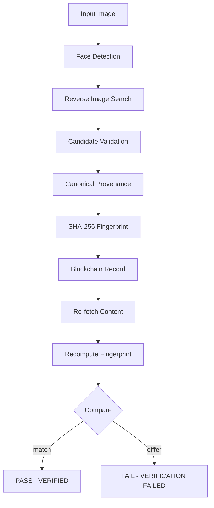

# Face Provenance — Face Detection + Web Provenance + Blockchain Verification

An end-to-end pipeline that takes a face image, performs **privacy-preserving
face detection**, runs a **genuine reverse-image / provenance search** against
publicly accessible content, builds a **canonical cryptographic fingerprint**
of the discovered content, records it on an **Ethereum-compatible blockchain**,
and **verifies** it by re-fetching, recomputing, and comparing.

> **Privacy by design.** This system **never identifies, names, profiles,
> tracks, or infers the identity of a real person from their face**. The face
> stage only reports *whether* a face exists, *where* it is, and a technical
> similarity score. The web stage performs reverse-image / provenance matching
> of the *content*, not identity search.

---

## Overview

```
input face image
      │
      ▼
face detection / local face encoding
      │
      ▼
reverse-image / web provenance search
      │
      ▼
candidate validation (multi-signal)
      │
      ▼
canonical provenance object
      │
      ▼
SHA-256 fingerprint
      │
      ▼
blockchain record
      │
      ▼
re-fetch → recompute → compare
      │
      ▼
      PASS / FAIL
```

The project ships in **two modes**:

| Mode   | Search                                  | Blockchain                            | Purpose                        |
| ------ | --------------------------------------- | ------------------------------------- | ------------------------------ |
| `demo` | local fixture (explicitly labelled)     | in-memory chain (explicitly labelled) | offline, reproducible demo     |
| `real` | Serper Google Lens API (API key needed) | Anvil (local) or a public testnet     | genuine end-to-end pipeline    |

Nothing is ever hardcoded: no fake search results, no fake transaction IDs,
no credentials. If no permitted match is found, the pipeline **reports
`NO_MATCH` with a reason** and touches no blockchain.

---

## Architecture

```
src/
  face/            privacy-preserving face detection + local encoding
    detector.py    pluggable detector (OpenCV Haar cascade)
    encoder.py     pluggable encoder (deterministic local embedding)
    service.py     FaceService: process() + compare()
  search/          reverse-image search and validation
    reverse_image.py   ReverseImageSearchProvider protocol + Serper + demo fixture
    publish.py         image publisher (local bytes -> transient public URL for Serper)
    web_search.py      HTTP fetching, robots.txt respect, timeouts, limits
    result_parser.py   multi-signal candidate validation (EXACT/NEAR/PAGE/NONE)
    phash.py           DCT perceptual hash (NumPy-only)
    fixture.py         demo fixture loading (always labelled demo)
  provenance/      canonical record + fingerprint
    extractor.py   fetch discovered content -> ProvenanceRecord
    fingerprint.py canonical JSON -> SHA-256
  blockchain/      contract, clients, verifier
    contract.py    artifact loading + solc compile fallback
    client.py      Web3BlockchainClient + InMemoryBlockchainClient
    verifier.py    verify_provenance(): re-fetch, recompute, compare
  pipeline/
    pipeline.py    Pipeline orchestrator (dependency-injected)
  models/
    schemas.py     Pydantic models shared by all stages
  web/
    app.py         FastAPI app (process/verify/sample-image endpoints)
    static/        dashboard frontend (HTML/CSS/JS, no build step)
  cli.py           command-line interface
contracts/
  ProvenanceRegistry.sol      Solidity registry (records fingerprints only)
  compiled/ProvenanceRegistry.json   precompiled artifact (no solc needed)
scripts/
  deploy_contract.py          deploy the registry to a chain
  run_demo.py                 offline end-to-end demo (PASS + tamper FAIL)
tests/
  test_face.py test_fingerprint.py test_blockchain.py
  test_pipeline.py test_search.py
```



Dependencies are injected throughout (`FaceDetector`, `FaceEncoder`,
`ReverseImageSearchProvider`, `ContentFetcher`, `BlockchainClient`), so every
external service is mockable and swappable without touching pipeline logic.

---

## Features

- **Privacy-preserving face processing** — detects faces, returns bounding
  boxes and a *technical-demonstration* embedding; never identity attributes.
- **Genuine reverse-image search** — pluggable provider interface with a real
  Serper (Google Lens) implementation; no fabricated results.
- **Multi-signal match validation** — SHA-256, perceptual hash (pHash),
  dimensions, title/URL signals; classifies `EXACT_MATCH`, `NEAR_MATCH`,
  `PAGE_MATCH`, `NO_MATCH` with an acceptance rationale.
- **Deterministic fingerprint** — canonical JSON (sorted keys, compact,
  UTF-8) hashed with SHA-256; identical content yields identical hashes on
  any machine. `retrieved_at` is recorded display metadata but excluded from
  the hash, so re-verifying *unchanged* content (even in a later run)
  reproduces the exact same fingerprint.
- **Minimal on-chain storage** — the `ProvenanceRegistry` contract stores
  only the fingerprint, submitter, timestamp, block number and an optional
  public source identifier. No faces, no embeddings, no private data.
- **Real verification** — re-fetches the content, rebuilds the canonical
  object, recomputes the SHA-256 and compares against the on-chain record.
- **Tamper detection** — any change to title, page text, or image produces a
  different fingerprint and a failed verification.
- **Offline demo** — fully reproducible without API keys or a running chain.
- **Docker support** — `docker compose` spins up Anvil + the CLI.
- **Web dashboard** — professional dark-themed UI (FastAPI + vanilla JS) with live pipeline stepper, bounding-box overlay, and one-click PASS / tamper-FAIL demos.
- **Tested** — 68 pytest cases covering every stage with mocked external APIs.

---

## Technology Stack

- Python 3.11+
- OpenCV (Haar cascade face detection) + NumPy + Pillow
- Pydantic (typed schemas), httpx / requests (HTTP)
- **FastAPI + uvicorn** (web dashboard) — vanilla HTML/CSS/JS frontend, no build step
- Web3.py (Ethereum), Solidity 0.8.24, py-solc-x (compile fallback)
- Anvil (local chain), eth-tester / py-evm (offline EVM in tests)
- pytest, python-dotenv, Docker / docker-compose

> **Why OpenCV Haar instead of InsightFace/FaceNet?** The detector and encoder
> are *pluggable interfaces*. Haar is a reputable, fully offline detector that
> keeps the install light and the tests deterministic. To use InsightFace
> instead, implement the `FaceDetector`/`FaceEncoder` protocols with it — the
> pipeline will not change.

---

## Prerequisites

- Python 3.11+
- (Optional, real mode) a free API key from [Serper](https://serper.dev)
- (Optional, real chain) [Foundry](https://getfoundry.sh) for `anvil`, or use
  Docker (`docker compose`) instead
- (Optional) Docker + docker-compose

---

## Installation

```bash
git clone <your-repo-url> face-provenance
cd face-provenance

python -m venv .venv
source .venv/bin/activate        # Windows: .venv\Scripts\activate
pip install -r requirements.txt

cp .env.example .env             # then edit .env as needed
```

The repository ships a precompiled contract artifact
(`contracts/compiled/ProvenanceRegistry.json`), so **no Solidity compiler is
needed at runtime**.

---

## Environment Variables

See `.env.example` for the full list with comments.

| Variable                      | Default                           | Purpose                                   |
| ----------------------------- | --------------------------------- | ----------------------------------------- |
| `BLOCKCHAIN_RPC_URL`          | `http://127.0.0.1:8545`           | Chain RPC endpoint                        |
| `BLOCKCHAIN_CHAIN_ID`         | `31337`                           | Anvil's default chain id                  |
| `BLOCKCHAIN_PRIVATE_KEY`      | Anvil dev key #0                  | Account that submits records (local dev)  |
| `PROVENANCE_CONTRACT_ADDRESS` | *(empty)*                         | Deployed registry address                 |
| `SEARCH_PROVIDER`             | `serper`                          | Reverse-image provider name               |
| `SEARCH_API_KEY`              | *(empty)*                         | Serper API key (real mode)                |
| `SEARCH_IMAGE_URL`            | *(empty)*                         | Public http(s) URL of the input image (optional; skip upload) |
| `REQUEST_TIMEOUT_SECONDS`     | `20`                              | HTTP timeouts                             |
| `ROBOTS_TXT_RESPECT`          | `true`                            | Respect robots.txt when fetching pages    |

**Security rules:** never commit `.env`; never hardcode keys; the key shown in
`.env.example` is Anvil's public **dev-only** account key — never use it on a
public testnet or mainnet.

---Any Ethereum-compatible chain works. Pick one option below (all expose RPC on
`http://127.0.0.1:8545` and fund the dev key already in `.env.example`):

### Option A — Hardhat (recommended, no Docker/Foundry install)

```bash
npm install          # installs the local Hardhat dev dependency
npx hardhat node     # boots the chain on 127.0.0.1:8545 (chain id 31337)
```

> The repo includes `package.json` + `hardhat.config.js` for this. The node
> prints 20 funded dev accounts; account #0 uses the same public dev key as
> `.env.example` (`0xac0974...ff80`) — LOCAL DEV ONLY.

### Option B — Foundry (local)

```bash
# install foundry once
curl -L https://foundry.paradigm.xyz | bash
foundryup

# start a local chain with a deterministic dev account
anvil
# Listening on 127.0.0.1:8545
# Account #0 private key: 0xac0974...ff80 (matches .env.example)
```

### Option C — Docker (easiest if you have Docker Desktop)

```bash
docker compose up -d anvil
```

### Option D — Ganache

```bash
npx -y ganache --wallet.account "0xac0974bec39a17e36ba4a6b4d238ff944bacb478cbed5efcae784d7bf4f2ff80,1000000000000000000000"
```

Any Ethereum-compatible chain works. Point `BLOCKCHAIN_RPC_URL` at it and set
the chain id to match (`31337` for Hardhat/Anvil, `1337` for Ganache).

---

## Smart Contract Deployment

```bash
python scripts/deploy_contract.py --save-env
```

This compiles (or reuses the committed artifact), connects to the chain from
`.env`, deploys `ProvenanceRegistry`, and appends the address to `.env`:

```json
{
  "blockchain": "local-ethereum",
  "contract_address": "0x5FbDB2315678afecb367f032d93F642f64180aa3",
  "transaction_hash": "0x9f1e...",
  "block_number": 1,
  "fingerprint": ""
}
```

---

## Web Dashboard

A polished, dark-themed dashboard (FastAPI + vanilla JS, no build step) for demos:

```bash
python -m uvicorn src.web.app:app --host 0.0.0.0 --port 8000
# or: python -m src.web.app
# open http://localhost:8000
```

What it shows, live:

- drag-&-drop image upload with the **detected face bounding box** drawn on the preview
- a 6-step pipeline stepper (face → search → validation → fingerprint → blockchain → verification) with status states
- match-type badges (`EXACT_MATCH` / `NEAR_MATCH` / `PAGE_MATCH` / `NO_MATCH`) and `ON-CHAIN` / `SIMULATED` labels, with acceptance rationale
- SHA-256 fingerprints and transaction hashes with one-click copy
- a big animated **VERIFIED / VERIFICATION FAILED** verdict
- a raw JSON drawer of the full pipeline result (judges love this)
- a real-only pipeline: every run performs a genuine Serper reverse-image
  search and records on the selected chain (Anvil by default)

API endpoints:

| Method | Path             | Purpose                                          |
| ------ | ---------------- | ------------------------------------------------ |
| GET    | `/`              | dashboard                                        |
| GET    | `/api/health`    | health + config status                           |
| GET    | `/api/sample-image` | bundled public-domain sample face             |
| POST   | `/api/process`   | full pipeline (multipart: `file`, `mode`, `chain`) |
| POST   | `/api/verify`    | re-verify (add `tamper=true` for the FAIL demo)  |

Uploads are processed from a temporary directory and discarded — no user images are stored.

## Running the Pipeline

### Demo mode (offline, no credentials, no chain needed)

```bash
python -m src.cli process ./data/sample_face.jpg --mode demo
```

`demo` mode uses:
- the **demo search provider** — replays the local fixture in
  `data/demo_fixture.json` (every result is labelled `demo=True`),
- the **in-memory blockchain** — a deterministic simulation (every record is
  labelled `simulated=True`).

### Real mode (Serper + Anvil)

```bash
# 1. configure .env
#    SEARCH_API_KEY=your_serper_key
#    BLOCKCHAIN_RPC_URL=http://127.0.0.1:8545

# 2. start the chain and deploy
docker compose up -d anvil
python scripts/deploy_contract.py --save-env

# 3. run the real pipeline
python -m src.cli process ./data/input.jpg --mode real --chain anvil
```

---

## Real Search Provider

1. Create a free account at [serper.dev](https://serper.dev) and copy your API
   key.
2. Put it in `.env`:
   ```bash
   SEARCH_PROVIDER=serper
   SEARCH_API_KEY=xxxxxxxxxxxxxxxxxxxx
   ```
3. Run with `--mode real`. The pipeline resolves a **public URL for the input
   image** and POSTs it to Serper's Google Lens endpoint with a timeout,
   handles rate limits (HTTP 429) and malformed responses, then validates
   every candidate before accepting a match.

Serper's Lens API requires the image to be reachable at a **public HTTP URL**
(it rejects raw bytes and base64). The pipeline resolves that URL in this
order:

1. `SEARCH_IMAGE_URL` (if you set it) — points to your own public copy of the
   input image; no upload happens.
2. Otherwise, the local image is uploaded to a **transient anonymous host**
   (`uguu.se`, via `src/search/publish.py`) purely to obtain a public URL for
   the search. The URL is used once and never stored.

The provider interface (`ReverseImageSearchProvider`) is pluggable — add
another provider by implementing
`search(image_bytes, mime, image_url=None) -> SearchResult`.

---

## Demo Mode

Demo mode exists because external reverse-image APIs require credentials and
social platforms restrict automated access. It lets you run — and
reproducibly test — the **entire pipeline** (including the blockchain
transaction and verification steps) with zero external dependencies.

It is **never presented as a real search**: the demo provider is labelled
`demo=True`, the in-memory chain labels every record `simulated=True`, and the
CLI prints `(DEMO MODE - local fixture, not a live search)`.

```bash
# offline end-to-end demo with PASS + tamper FAIL + explicit hash comparison
python scripts/run_demo.py
```

---

## Verification

Example successful verification (demo mode):

```
[1] Face detection
    Face detected: YES
    Faces: 1

[2] Reverse-image search
    Provider: demo-fixture (DEMO MODE - local fixture, not a live search)
    Match found: YES

[3] Candidate validation
    Match type: EXACT_MATCH
    Rationale: Candidate image bytes are byte-identical to the input (SHA-256 equal)

[4] Fingerprint
    SHA256: 4f46c1bb94e627965f8879a79cc3a9f275615b39e86a3e4a08a1654521be2d7f

[5] Blockchain
    Blockchain: in-memory (SIMULATED)
    Contract: 0x0000000000000000000000000000000000000000
    Transaction: 0xc07df72851a8822160c6bb32a23ee4ff5bb515018197b8d4cec3c5202a0556b8
    Block: 1

[6] Verification
    Status: VERIFIED
    Reason: Cryptographic fingerprints match
    Calculated: 4f46c1bb94e627965f8879a79cc3a9f275615b39e86a3e4a08a1654521be2d7f
    On-chain: 4f46c1bb94e627965f8879a79cc3a9f275615b39e86a3e4a08a1654521be2d7f

[FINAL] VERIFICATION VERIFIED
```

---

## Tamper Detection

Changing any part of the discovered content (title, page text, or image)
changes the SHA-256 fingerprint, so re-verification fails:

```bash
python -m src.cli verify ./data/sample_face.jpg --mode demo --tamper
```

```
[6] Verification
    Status: FAILED
    Reason: Content fingerprint differs from blockchain record
    Calculated: bebc0ddf478aee1d27195e5d3b3307ebf4d8f38cad7d3735d59d7180173a22a9
    On-chain: (none)

[FINAL] VERIFICATION FAILED
```

Explicit fingerprint comparison (from `scripts/run_demo.py`):

```
Original content fingerprint : cd52e07db22a87f705946ef91b672eb77ac731b74b1a1ea310e1fd87836c9cb2
Tampered content fingerprint : 9ba9223ea17dc23c125532dff6c0a453c43e4f3baef6743a7044f8ea0484fe03
Fingerprints differ         : True
```

---

## Tests

```bash
python -m pytest -q      # 68 tests
```

The suite runs fully offline: web APIs are mocked with `httpx.MockTransport`,
and blockchain tests run against a **real local EVM** (eth-tester / py-evm)
deploying the actual compiled contract.

Coverage highlights:
- face detection (single, none, multiple), deterministic encoding, similarity
- no-face and multiple-face images
- deterministic canonicalization (sorted keys, no whitespace, UTF-8)
- SHA-256 fingerprint generation and tamper sensitivity
- blockchain record creation, verification, duplicate rejection (real EVM)
- tampered-data detection on-chain
- failed web match and successful web match with a mocked provider
- provider error handling (rate limit, server error, malformed JSON)
- robots.txt respect in the HTTP fetcher
- web API: health, dashboard, process, verify, tamper detection

---

## Security / Privacy

- **The system does not identify people from faces.** Face processing is
  limited to presence, location, a local technical embedding, and similarity
  scores between images the same user supplies.
- **No personally identifying data ever touches the blockchain.** Only the
  SHA-256 fingerprint (plus optional public source identifier) is recorded.
- **No credentials in the repository.** Keys come from `.env` (see
  `.env.example`); `.env` is git-ignored.
- **No fabricated results.** Unavailable providers or failed matches are
  reported, never simulated.
- **Defensive fetching.** HTTP(S)-only, robots.txt-respecting, timeouts, size
  limits, Content-Type checks, malformed-response handling.
- **Robust error handling.** Network failures, rate limits, unavailable
  pages, and blockchain transaction failures are caught and surfaced.

---

## Limitations

- Reverse-image providers may require API credentials (Serper) and have rate
  limits; the demo fixture is the credential-free path.
- Social platforms often restrict automated access; only publicly accessible,
  permitted content is fetched.
- Public pages can disappear or change, which makes later verification fail
  even if the original record was legitimate.
- Perceptual similarity (pHash) is not proof of identity or authenticity — it
  is one signal among several.
- The blockchain stores a **fingerprint**, not the original content — the
  content itself must be re-fetched from the web.
- Blockchain confirmation does not prove the *truthfulness* of the underlying
  content; it only proves the fingerprint was recorded at a point in time.
- Only the **integrity of the recorded fingerprint** is verifiable — if the
  original content was already wrong, verification passes for wrong content.
- The in-memory chain is per-process: use `--chain anvil` when you need
  verification across separate CLI invocations.

---

## License

MIT — see [LICENSE](LICENSE).

---

## GitHub Quick Start

```bash
git init
git add .
git commit -m "Add face detection + web provenance + blockchain verification pipeline"
git branch -M main
git remote add origin https://github.com/<you>/<repo>.git
git push -u origin main
```

The repository contains **no credentials, tokens, private keys, or personal
data**. `.env` is ignored; the only key-like value in the repo is Anvil's
public dev key in `.env.example`, which is safe to commit by design.
